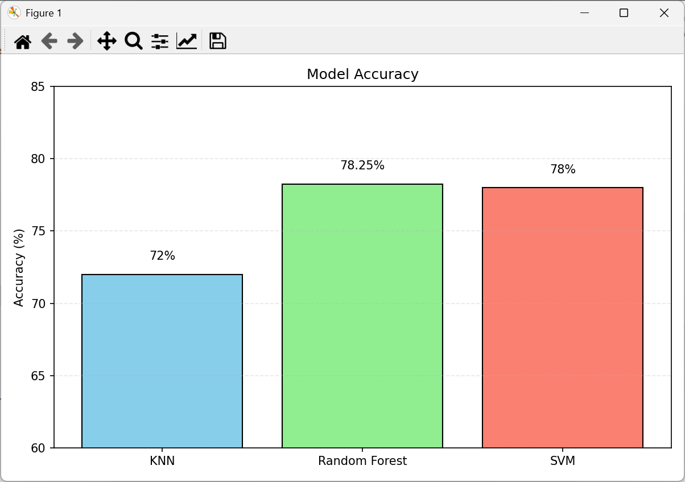
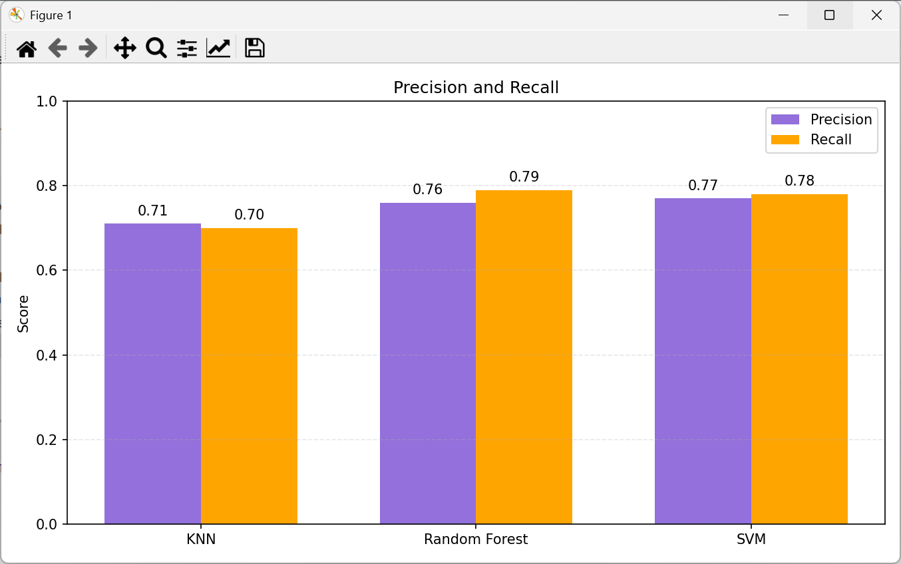
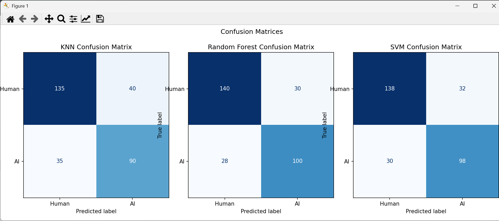

# 🎨 AI vs Human Art Classifier

In a world where AI is becoming part of everyday creativity, this project looks at the small but important differences between art made by humans and art made by machines. Using a simple classifier, I want to show how technology can help us see the value in both types of art, while also reminding us of the special touch that makes human creativity unique. For this, I built three basic machine learning models: K-Nearest Neighbors (KNN), Random Forest, and a hand-coded Support Vector Machine (SVM). The goal is to train machines to tell the difference between human and AI art, something even people sometimes find hard to do.

---

## Project Overview

- ✅ Built in **Python 3.13** using **NumPy**, **Pillow**, **Matplotlib**, and **scikit-learn**
- ✅ Implements 3 classifiers:
  - **Custom K-Nearest Neighbors (KNN)** (from scratch)
  - **Random Forest** (using `DecisionTreeClassifier` from scikit-learn)
  - **Custom linear Support Vector Machine (SVM)** (from scratch)
- ✅ Includes visualizations:
  - **Accuracy**, **Precision**, **Recall**
  - **Confusion Matrices**
- ✅ Dataset sourced from [Kaggle](https://www.kaggle.com/datasets/kausthubkannan/ai-and-human-art-classification)
- ✅ Lightweight, well-structured, and beginner-friendly


---

## 🗂️ Project Structure

```
ai-vs-human-art-classifier/
├── data/                     # not pushed to GitHub (see below)
│   ├── ai_art/               # AI-generated art
│   ├── human_art/            # Human-created art
│   └── test/                 # Optional test samples
├── results/                  # Visualization outputs
│   ├── accuracy.png
│   ├── precision_recall.png
│   └── confusion_matrices.png
├── src/                      # All Python source code
│   ├── preprocessing.py
│   ├── model_knn.py
│   ├── model_rf.py
│   ├── model_svm.py
│   ├── predict.py
│   └── visualize.py
├── .gitignore
├── README.md
└── requirements.txt
```

---

## 🖼️ Dataset

- 🔗 [Kaggle Dataset: AI and Human Art Classification](https://www.kaggle.com/datasets/kausthubkannan/ai-and-human-art-classification)
- Contains images from both **AI tools** and **human artists**
- Pre-labeled into folders: `AI_Art` and `Human_Art`

### 📁 How to Set Up the Data

After downloading:

```
data/
├── ai_art/         → from AI_Art folder
├── human_art/      → from Human_Art folder
└── test/           → (Optional) any custom image to test
```

> ❗ The entire `data/` folder is **excluded** from GitHub using `.gitignore` to keep the repo lightweight. You'll need to add it manually before running the code.

---

## ⚙️ How to Run the Project

### 1. Clone the Repository

```bash
git clone https://github.com/your-username/ai-vs-human-art-classifier.git
cd ai-vs-human-art-classifier
```

### 2. Set Up the Environment

```bash
python -m venv .venv
source .venv/bin/activate    # On Windows: .venv\Scripts\activate
pip install -r requirements.txt
```

### 3. Preprocess the Images

```bash
python src/preprocessing.py
```

### 4. Train Each Model

```bash
python src/model_knn.py
python src/model_rf.py
python src/model_svm.py
```

### 5. Predict a Random Test Image

```bash
python src/predict.py
```

### 6. Visualize Model Performance

```bash
python src/visualize.py
```

---

<h2>📊 Visual Outputs</h2>

<p align="center" style="display: flex; justify-content: center; gap: 10px;">
  
  
  
</p>


---

## Sample Output

```
Selected test image: data/test/sample.jpg

KNN Prediction            : Human Art  | Accuracy: 72.00%
Random Forest Prediction  : AI Art     | Accuracy: 78.25%
SVM Prediction            : AI Art     | Accuracy: 78.00%
```

---

## Dependencies

Listed in `requirements.txt` (see next file). Major libraries include:
- numpy
- Pillow (PIL)
- matplotlib
- scikit-learn

---

## 💡 Notes

- Images resized to **64×64 pixels**, RGB
- Each model trained on max **1000 samples per class**
- Binary labels: `0 = Human`, `1 = AI`
- All metrics calculated manually or using `sklearn`
- Graphs saved in `results/` and linked to this README

---

## Credits

- **Dataset** by [Kausthub Kannan on Kaggle](https://www.kaggle.com/datasets/kausthubkannan/ai-and-human-art-classification)


---

## License

This repository is open for **academic** and **educational** purposes.  
Dataset copyright remains with the original creators.

---
